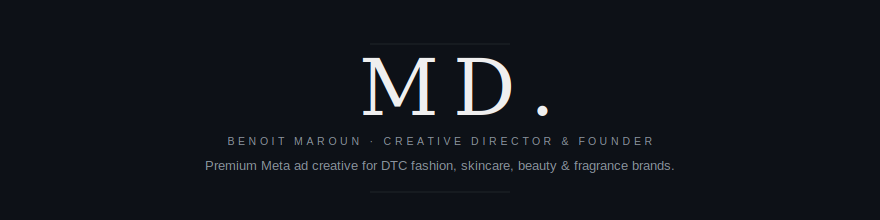
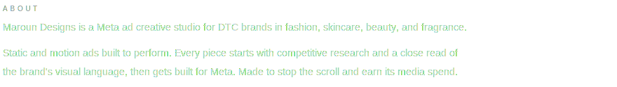
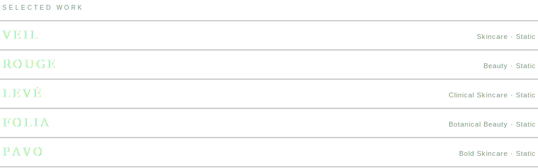
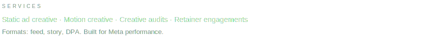
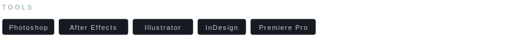
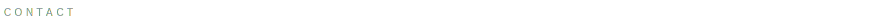

<picture>
  <source media="(prefers-color-scheme: dark)" srcset="./header-dark.svg">
  <source media="(prefers-color-scheme: light)" srcset="./header-light.svg">
  
</picture>

 

[**Portfolio**](https://maroundesigns.github.io/portfolio) &nbsp;&nbsp;·&nbsp;&nbsp; [**Book a Call**](https://calendly.com/maroundesigns/new-meeting) &nbsp;&nbsp;·&nbsp;&nbsp; [**Instagram**](https://instagram.com/maroundesigns) &nbsp;&nbsp;·&nbsp;&nbsp; [**LinkedIn**](https://linkedin.com/in/benoit-hayek-946b71387)

  

<picture>
  <source media="(prefers-color-scheme: dark)" srcset="./about-dark.svg">
  <source media="(prefers-color-scheme: light)" srcset="./about-light.svg">
  
</picture>

---

<picture>
  <source media="(prefers-color-scheme: dark)" srcset="./selected-work-dark.svg">
  <source media="(prefers-color-scheme: light)" srcset="./selected-work-light.svg">
  
</picture>

 

→ [View full portfolio](https://maroundesigns.github.io/portfolio)

---

<picture>
  <source media="(prefers-color-scheme: dark)" srcset="./services-dark.svg">
  <source media="(prefers-color-scheme: light)" srcset="./services-light.svg">
  
</picture>

---

<picture>
  <source media="(prefers-color-scheme: dark)" srcset="./tools-dark.svg">
  <source media="(prefers-color-scheme: light)" srcset="./tools-light.svg">
  
</picture>

---

<picture>
  <source media="(prefers-color-scheme: dark)" srcset="./contact-label-dark.svg">
  <source media="(prefers-color-scheme: light)" srcset="./contact-label-light.svg">
  
</picture>

[maroundesigns@gmail.com](mailto:maroundesigns@gmail.com) &nbsp;&nbsp;·&nbsp;&nbsp; [Book a 15-min call](https://calendly.com/maroundesigns/new-meeting)

[@maroundesigns](https://instagram.com/maroundesigns) on Instagram
